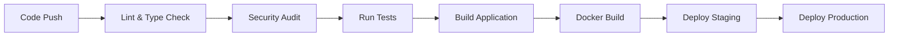

# Crowdfund Backend Express

A comprehensive crowdfunding backend API built with Express.js, TypeScript, Sequelize, PostgreSQL, and Redis.

## 🚀 Features

- **TypeScript**: Full TypeScript support with type safety
- **Express.js**: Fast and minimal web framework
- **PostgreSQL**: Robust relational database with Sequelize ORM
- **Redis**: Session storage and caching
- **JWT Authentication**: Secure authentication system with role-based access control
- **Payment Processing**: Xendit integration for donations and payments
- **Withdrawal System**: Complete fund withdrawal management with admin approval workflow
- **File Uploads**: Image upload handling for avatars and project images with Sharp processing
- **Background Jobs**: Automated payment reconciliation and project status management
- **Swagger Documentation**: Interactive API documentation
- **Docker**: Containerized application with Docker Compose
- **CI/CD Pipeline**: GitHub Actions with automated testing, linting, and deployment
- **Health Checks**: Built-in health monitoring endpoints
- **Security**: Helmet, CORS, rate limiting, input validation, and audit trails
- **Database Migrations**: Sequelize migrations for database versioning
- **Comprehensive Testing**: Unit and integration tests with Jest

## 📋 Prerequisites

- Node.js (v18 or higher)
- Docker and Docker Compose
- PostgreSQL (if running locally)
- Redis (if running locally)

## 🛠️ Installation & Setup

### Option 1: Using Docker (Recommended)

1. **Clone the repository**

   ```bash
   git clone <repository-url>
   cd crowdfund-backend-express
   ```

2. **Install dependencies**

   ```bash
   npm install
   ```

3. **Start with Docker Compose**

   ```bash
   docker-compose up -d
   ```

4. **Run database migrations**

   ```bash
   docker-compose exec app npm run migrate
   ```

5. **Access the application**
   - API: <http://localhost:3000>
   - Swagger Documentation: <http://localhost:3000/api-docs>
   - Health Check: <http://localhost:3000/health>

### Option 2: Local Development

1. **Clone and install**

   ```bash
   git clone <repository-url>
   cd crowdfund-backend-express
   npm install
   ```

2. **Setup environment variables**

   ```bash
   cp .env.example .env
   # Edit .env with your local database and Redis credentials
   ```

3. **Start PostgreSQL and Redis locally**

4. **Run migrations**

   ```bash
   npm run migrate
   ```

5. **Start development server**

   ```bash
   npm run dev
   ```

## 🔧 Environment Variables

Copy `.env.example` to `.env` and configure the following variables:

### Required Variables

```env
# Server Configuration
NODE_ENV=development
PORT=3000
FRONTEND_URL=http://localhost:3000
CORS_ORIGIN=http://localhost:3000

# Authentication & Security
JWT_SECRET=your_jwt_secret_key_here  # Generate with: node -e "console.log(require('crypto').randomBytes(32).toString('hex'))"
JWT_EXPIRES_IN=24h
SESSION_SECRET=your_session_secret_key_here  # Generate with: node -e "console.log(require('crypto').randomBytes(32).toString('hex'))"

# Database Configuration
DB_HOST=localhost
DB_PORT=5432
DB_NAME=crowdfund_development
DB_USER=postgres
DB_PASSWORD=password

# Redis Configuration
REDIS_HOST=localhost
REDIS_PORT=6379
REDIS_PASSWORD=
```

### Payment & Withdrawal Configuration

```env
# Xendit Payment Gateway (get from https://dashboard.xendit.co/)
XENDIT_SECRET_KEY=xnd_test_your_secret_key_here
XENDIT_PUBLIC_KEY=xnd_public_test_your_public_key_here
XENDIT_CALLBACK_URL=http://localhost:3000/api/payments/webhook/xendit

# Withdrawal Settings
MINIMUM_WITHDRAWAL_AMOUNT=10000          # In smallest currency unit (e.g., cents)
MAXIMUM_WITHDRAWAL_AMOUNT=100000000000   # In smallest currency unit
DEFAULT_PROCESSING_FEE_RATE=0.005        # 0.5% processing fee
```

### Optional Configuration

```env
# File Upload Configuration
MAX_FILE_SIZE=5242880                    # 5MB in bytes
UPLOAD_DIR=uploads
AVATAR_UPLOAD_DIR=uploads/avatars
PROJECT_IMAGE_UPLOAD_DIR=uploads/projects

# Logging
LOG_LEVEL=info                           # fatal, error, warn, info, debug, trace
LOG_PRETTY=true

# Rate Limiting
RATE_LIMIT_WINDOW_MS=900000              # 15 minutes
RATE_LIMIT_MAX_REQUESTS=100

# Development Tools
ENABLE_SWAGGER=true
DB_LOGGING=false
```

### Production Environment Variables

For production deployment, additionally set:

```env
NODE_ENV=production
LOG_LEVEL=warn
LOG_PRETTY=false
DB_LOGGING=false
ENABLE_SWAGGER=false

# Use live Xendit keys
XENDIT_SECRET_KEY=xnd_production_your_live_secret_key
XENDIT_PUBLIC_KEY=xnd_public_production_your_live_public_key
XENDIT_CALLBACK_URL=https://yourdomain.com/api/payments/webhook/xendit
```

### Security Key Generation

Generate secure keys for JWT and Session secrets:

```bash
# Generate JWT secret
node -e "console.log('JWT_SECRET=' + require('crypto').randomBytes(32).toString('hex'))"

# Generate Session secret
node -e "console.log('SESSION_SECRET=' + require('crypto').randomBytes(32).toString('hex'))"
```

## 📝 Available Scripts

### Development
- `npm run dev` - Start development server with hot reload
- `npm run build` - Build TypeScript to JavaScript
- `npm run build:watch` - Build with watch mode
- `npm run start` - Start production server

### Code Quality
- `npm run lint` - Run ESLint and auto-fix issues
- `npm run lint:check` - Check code with ESLint (no auto-fix)
- `npm run format` - Format code with Prettier
- `npm run format:check` - Check code formatting with Prettier
- `npm run typecheck` - Run TypeScript type checking
- `npm run ci:check` - Run all checks (lint, typecheck, tests with coverage)

### Testing
- `npm test` - Run tests
- `npm run test:watch` - Run tests in watch mode
- `npm run test:coverage` - Run tests with coverage report

### Database Management
- `npm run migrate` - Run database migrations
- `npm run migrate:undo` - Undo last migration
- `npm run seed` - Run database seeders
- `npm run seed:dummy` - Seed database with realistic test data (40 users, 20 projects)
- `npm run seed:admin` - Create admin test users only
- `npm run db:clear` - Clear all data from database (with confirmation)
- `npm run db:reset` - Clear database and re-seed with dummy data
- `npm run db:setup` - Run migrations and create admin users
- `npm run db:create` - Create database
- `npm run db:drop` - Drop database

## 📚 API Endpoints

### Authentication
- `POST /api/auth/register` - Register new user
- `POST /api/auth/login` - Login user
- `POST /api/auth/logout` - Logout user (requires auth)
- `GET /api/auth/me` - Get current user profile (requires auth)

### Users
- `GET /api/users` - List all users (admin only)
- `GET /api/users/:id` - Get user by ID
- `PUT /api/users/:id` - Update user profile
- `PATCH /api/users/:id/activate` - Activate user (admin)
- `PATCH /api/users/:id/deactivate` - Deactivate user (admin)
- `POST /api/users/avatar` - Upload user avatar (requires auth)
- `GET /api/users/profile` - Get current user profile (requires auth)
- `PUT /api/users/profile` - Update current user profile (requires auth)
- `POST /api/users/change-password` - Change user password (requires auth)
- `GET /api/users/stats` - Get user statistics (requires auth)

### Projects
- `GET /api/projects` - List projects (with search, filters, pagination)
- `POST /api/projects` - Create new project (fundraisers only)
- `GET /api/projects/:id` - Get project details with donations
- `PUT /api/projects/:id` - Update project (owner or admin)
- `DELETE /api/projects/:id` - Delete project (owner or admin)
- `GET /api/projects/my` - Get current user's projects
- `POST /api/projects/:id/image` - Upload project image (owner only)
- `DELETE /api/projects/:id/image/:imageId` - Remove project image (owner only)

### Donations
- `GET /api/donations` - List donations (with filters)
- `POST /api/donations` - Create donation (anonymous or authenticated)
- `GET /api/donations/:id` - Get donation details
- `GET /api/donations/my` - Get current user's donations
- `GET /api/donations/project/:id` - Get donations for specific project

### Payments (Xendit Integration)
- `POST /api/payments/create-charge` - Create payment charge
- `POST /api/payments/create-invoice` - Create payment invoice
- `POST /api/payments/create-va` - Create virtual account payment
- `GET /api/payments/:id` - Get payment details
- `POST /api/payments/webhook/xendit` - Xendit webhook handler (public)

### Withdrawals
- `GET /api/withdrawals/eligibility/:projectId` - Check withdrawal eligibility
- `POST /api/withdrawals` - Create withdrawal request (fundraiser only)
- `GET /api/withdrawals/my` - Get user's withdrawal requests
- `GET /api/withdrawals/:id` - Get withdrawal details
- `POST /api/withdrawals/:id/cancel` - Cancel pending withdrawal
- `GET /api/withdrawals/project/:projectId/stats` - Get project withdrawal stats
- `GET /api/withdrawals/admin/pending` - Get pending withdrawals (admin only)
- `POST /api/withdrawals/:id/approve` - Approve/reject withdrawal (admin only)
- `POST /api/withdrawals/:id/process` - Process approved withdrawal (admin only)
- `POST /api/withdrawals/webhook/xendit` - Xendit webhook for withdrawals (public)

### File Uploads
- `GET /api/uploads/check-folders` - Check upload directories status
- `POST /api/uploads/avatar` - Upload user avatar
- `POST /api/uploads/project` - Upload project image

### Admin
- `GET /api/admin/users` - List all users with admin filters
- `GET /api/admin/projects` - List all projects with admin filters
- `GET /api/admin/donations` - List all donations with admin filters
- `GET /api/admin/stats` - Get platform statistics
- `POST /api/admin/users/:id/role` - Change user role

### Health Checks

- `GET /health` - Service health status
- `GET /health/ready` - Readiness probe
- `GET /health/live` - Liveness probe
- `POST /shutdown` - Graceful shutdown (development only)

### Documentation

- `GET /api-docs` - Swagger UI documentation

## 🧪 Test Data & Quick Start

### Quick Setup with Test Data
```bash
# Setup database and create admin users
npm run db:setup

# Or seed with realistic dummy data for testing
npm run seed:dummy
```

### Test User Credentials (after `npm run seed:admin`)
```
Admin User:
  Email: admin@crowdfund.com
  Password: admin123

Fundraiser User:
  Email: fundraiser@crowdfund.com  
  Password: fundraiser123

Regular User:
  Email: user@crowdfund.com
  Password: user123
```

### Dummy Data Overview (after `npm run seed:dummy`)
- **40 Users**: 20 regular users + 20 fundraisers with unique emails
- **20 Projects**: Realistic crowdfunding projects across various categories
- **60-300 Donations**: Mix of anonymous and authenticated donations
- **All Project States**: ACTIVE, CLOSED, CANCELLED for comprehensive testing
- **Realistic Scenarios**: Some projects fully funded, others ongoing or expired

## 🔐 Authentication

The API uses JWT (JSON Web Tokens) for authentication. Include the token in the Authorization header:

```
Authorization: Bearer <your-jwt-token>
```

## 📖 API Documentation

Visit `/api-docs` when the server is running to access interactive Swagger documentation.

## 🐳 Docker Commands

```bash
# Start all services
docker-compose up -d

# View logs
docker-compose logs -f app

# Run migrations
docker-compose exec app npm run migrate

# Access database
docker-compose exec postgres psql -U postgres -d crowdfund_db

# Access Redis CLI
docker-compose exec redis redis-cli

# Stop all services
docker-compose down

# Rebuild and start
docker-compose up --build -d
```

## 🗄️ Database

The application uses PostgreSQL with Sequelize ORM. The database schema includes comprehensive tables for users, projects, donations, payments, and withdrawals.

### Database Schema Overview

```
┌─────────────────┐    ┌──────────────────┐    ┌─────────────────┐
│     Users       │    │    Projects      │    │   Donations     │
├─────────────────┤    ├──────────────────┤    ├─────────────────┤
│ id (ULID)       │───┐│ id (ULID)        │───┐│ id (ULID)       │
│ email           │   ││ userId (FK)      │   ││ projectId (FK)  │
│ password        │   ││ title            │   ││ userId (FK)     │
│ role            │   ││ description      │   ││ amount          │
│ firstName       │   ││ goalAmount       │   ││ donorName       │
│ lastName        │   ││ currentAmount    │   ││ donorEmail      │
│ avatarUrl       │   ││ startDate        │   ││ isAnonymous     │
│ isActive        │   ││ endDate          │   ││ paymentMethod   │
│ createdAt       │   ││ status           │   ││ status          │
│ updatedAt       │   ││ category         │   ││ createdAt       │
└─────────────────┘   │└──────────────────┘   │└─────────────────┘
                      │                       │
                      └───────────────────────┘

┌─────────────────┐    ┌──────────────────┐    ┌─────────────────┐
│    Payments     │    │   Withdrawals    │    │ ProjectImages   │
├─────────────────┤    ├──────────────────┤    ├─────────────────┤
│ id (ULID)       │    │ id (ULID)        │    │ id (ULID)       │
│ donationId (FK) │    │ userId (FK)      │    │ projectId (FK)  │
│ xenditPaymentId │    │ projectId (FK)   │    │ filename        │
│ amount          │    │ amount           │    │ originalName    │
│ status          │    │ method           │    │ size            │
│ paymentMethod   │    │ status           │    │ mimetype        │
│ paidAt          │    │ processingFee    │    │ url             │
│ createdAt       │    │ netAmount        │    │ createdAt       │
│ updatedAt       │    │ bankName         │    │ updatedAt       │
└─────────────────┘    │ accountNumber    │    └─────────────────┘
                       │ approvedAt       │
                       │ completedAt      │
                       └──────────────────┘
```

### Key Database Features

- **ULID Primary Keys**: All tables use ULID for distributed-system-friendly unique identifiers
- **Foreign Key Constraints**: Proper relationships between all entities
- **Audit Trails**: Created/updated timestamps on all tables
- **Indexes**: Strategic indexes for performance on frequently queried columns
- **Enum Values**: Status fields use database enums for data integrity

### Migration Commands

```bash
# Create new migration
npx sequelize-cli migration:generate --name migration-name

# Run migrations
npm run migrate

# Undo last migration
npm run migrate:undo

# Reset database (caution!)
npm run db:drop && npm run db:create && npm run migrate
```

### Database Visualization & Management

#### Using pgAdmin (Recommended for GUI)

1. **Install pgAdmin**: Download from [pgadmin.org](https://www.pgadmin.org/download/)

2. **Connect to Database**:
   ```
   Host: localhost (or your DB_HOST)
   Port: 5432
   Database: crowdfund_development
   Username: postgres (or your DB_USER)
   Password: your_db_password
   ```

3. **Visualize Schema**:
   - Navigate to `Servers → PostgreSQL → Databases → crowdfund_development → Schemas → public → Tables`
   - Right-click on tables and select "View/Edit Data" to browse records
   - Use the "ERD Tool" to generate entity relationship diagrams

#### Using DBeaver (Free Universal Database Tool)

1. **Install DBeaver**: Download from [dbeaver.io](https://dbeaver.io/download/)

2. **Create Connection**:
   ```
   Database: PostgreSQL
   Host: localhost
   Port: 5432
   Database: crowdfund_development
   Username: postgres
   Password: your_db_password
   ```

3. **Generate ERD**:
   - Right-click on database → "View Diagram"
   - DBeaver will automatically generate visual relationships between tables

#### Using Database Commands

```bash
# Connect to PostgreSQL via Docker
docker-compose exec postgres psql -U postgres -d crowdfund_development

# Or connect to local PostgreSQL
psql -h localhost -U postgres -d crowdfund_development

# List all tables
\dt

# Describe table structure
\d users

# View table relationships
SELECT 
    tc.table_name, 
    kcu.column_name, 
    ccu.table_name AS foreign_table_name,
    ccu.column_name AS foreign_column_name 
FROM 
    information_schema.table_constraints AS tc 
    JOIN information_schema.key_column_usage AS kcu
      ON tc.constraint_name = kcu.constraint_name
    JOIN information_schema.constraint_column_usage AS ccu
      ON ccu.constraint_name = tc.constraint_name
WHERE constraint_type = 'FOREIGN KEY';

# Check table sizes and row counts
SELECT 
    schemaname,
    tablename,
    attname,
    n_distinct,
    null_frac,
    avg_width,
    n_tup_ins,
    n_tup_upd,
    n_tup_del
FROM pg_stats 
WHERE schemaname = 'public'
ORDER BY tablename, attname;
```

#### Database Monitoring Queries

```sql
-- Check database size
SELECT pg_size_pretty(pg_database_size('crowdfund_development'));

-- Check table sizes
SELECT 
    tablename,
    pg_size_pretty(pg_total_relation_size(schemaname||'.'||tablename)) as size
FROM pg_tables 
WHERE schemaname = 'public' 
ORDER BY pg_total_relation_size(schemaname||'.'||tablename) DESC;

-- Check active connections
SELECT count(*) FROM pg_stat_activity WHERE datname = 'crowdfund_development';

-- View recent activity
SELECT 
    query_start,
    state,
    query 
FROM pg_stat_activity 
WHERE datname = 'crowdfund_development' 
ORDER BY query_start DESC 
LIMIT 10;
```

#### Quick Data Analysis

```sql
-- Platform overview
SELECT 
    (SELECT COUNT(*) FROM users) as total_users,
    (SELECT COUNT(*) FROM projects) as total_projects,
    (SELECT COUNT(*) FROM donations) as total_donations,
    (SELECT SUM(amount) FROM donations WHERE status = 'PAID') as total_donated,
    (SELECT COUNT(*) FROM withdrawals) as total_withdrawals;

-- Project statistics
SELECT 
    status,
    COUNT(*) as count,
    AVG(goal_amount) as avg_goal,
    AVG(current_amount) as avg_raised
FROM projects 
GROUP BY status;

-- User role distribution
SELECT 
    role,
    COUNT(*) as count,
    COUNT(*) * 100.0 / (SELECT COUNT(*) FROM users) as percentage
FROM users 
GROUP BY role;
```

## 🔧 Development

### Project Structure

```
src/
├── config/          # Configuration files
│   ├── database.ts  # Database configuration
│   ├── redis.ts     # Redis configuration
│   └── swagger.ts   # Swagger configuration
├── middleware/      # Express middleware
│   └── auth.ts      # JWT authentication middleware
├── models/          # Sequelize models
│   ├── index.ts     # Models index
│   └── user.ts      # User model
├── routes/          # API routes
│   └── auth.ts      # Authentication routes
├── types/           # TypeScript type definitions
│   └── index.ts     # Global types
├── migrations/      # Database migrations
└── server.ts        # Main server file
```

### Adding New Features

1. **Add new routes**: Create route files in `src/routes/`
2. **Add models**: Create model files in `src/models/`
3. **Add migrations**: Use Sequelize CLI to generate migrations
4. **Add middleware**: Create middleware in `src/middleware/`
5. **Update types**: Add TypeScript types in `src/types/`

## 🧪 Testing

```bash
# Run tests (when implemented)
npm test

# Run tests with coverage
npm run test:coverage
```

## 🚀 CI/CD Pipeline

The project includes a comprehensive GitHub Actions CI/CD pipeline with the following features:

### Automated Workflows

- **Code Quality Checks**: ESLint, Prettier, and TypeScript type checking
- **Security Scanning**: Dependency audit and secret detection with TruffleHog
- **Testing**: Unit and integration tests with coverage reporting
- **Database Validation**: Schema validation and migration testing
- **Build Verification**: Application build and startup testing
- **Docker Support**: Container build and registry push
- **Multi-Environment Deployment**: Staging and production deployment workflows

### Pipeline Stages



### CI Configuration

The pipeline runs on:
- **Push**: to `master`, `main`, or `develop` branches
- **Pull Requests**: targeting main branches
- **Services**: PostgreSQL and Redis containers for testing

### Environment Setup

Tests run with:
- Node.js 18.x
- PostgreSQL 14
- Redis 6
- Comprehensive test environment variables

### Deployment

- **Staging**: Automatic deployment on `develop` branch
- **Production**: Automatic deployment on `master` branch
- **Artifacts**: Build artifacts stored for 7 days
- **Notifications**: Success/failure notifications

## 🚀 Production Deployment

### Manual Deployment

1. **Build the application**

   ```bash
   npm run build
   ```

2. **Set production environment variables**

3. **Run migrations**

   ```bash
   NODE_ENV=production npm run migrate
   ```

4. **Start production server**

   ```bash
   npm start
   ```

### Docker Deployment

1. **Build Docker image**

   ```bash
   docker build -t crowdfund-backend .
   ```

2. **Run with Docker Compose**

   ```bash
   docker-compose -f docker-compose.prod.yml up -d
   ```

### Deployment Checklist

- [ ] Environment variables configured
- [ ] Database migrations run
- [ ] SSL certificates configured
- [ ] Domain DNS configured
- [ ] Health checks responding
- [ ] Logging configured
- [ ] Monitoring setup
- [ ] Backup strategy implemented

## 🔍 Monitoring

### Health Checks

- `/health` - Comprehensive health check (database + redis)
- `/health/ready` - Kubernetes readiness probe
- `/health/live` - Kubernetes liveness probe

### Logging

The application logs important events:

- Database connection status
- Redis connection status
- Authentication attempts
- Error handling

## 🤝 Contributing

1. Fork the repository
2. Create a feature branch: `git checkout -b feature/new-feature`
3. Commit changes: `git commit -am 'Add new feature'`
4. Push to branch: `git push origin feature/new-feature`
5. Submit a pull request

## 📄 License

This project is licensed under the ISC License.

## 🆘 Troubleshooting

### Common Issues

1. **Database connection issues**
   - Verify PostgreSQL is running
   - Check database credentials in `.env`
   - Ensure database exists

2. **Redis connection issues**
   - Verify Redis is running
   - Check Redis host/port in `.env`

3. **Migration errors**
   - Check database connection
   - Verify migration files syntax
   - Run `npm run db:create` if database doesn't exist

4. **Docker issues**
   - Run `docker-compose down` and `docker-compose up --build`
   - Check Docker logs: `docker-compose logs app`

### Getting Help

- Check the logs: `docker-compose logs app`
- Verify environment variables
- Check database and Redis connectivity
- Review API documentation at `/api-docs`

Local Build

- local db : docker run --name postgres-dev -e POSTGRES_DB=crowdfund_db -e POSTGRES_USER=postgres -e POSTGRES_PASSWORD=password -p 5432:5432 -d postgres:15-alpine
- local redis : docker run --name redis-dev -p 6379:6379 -d redis:7-alpine redis-server --appendonly yes
